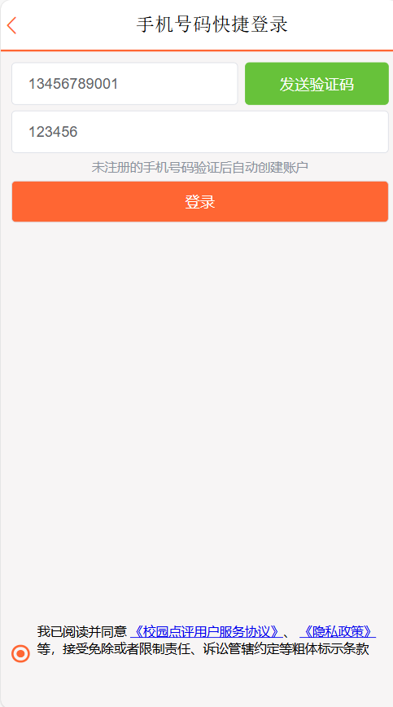
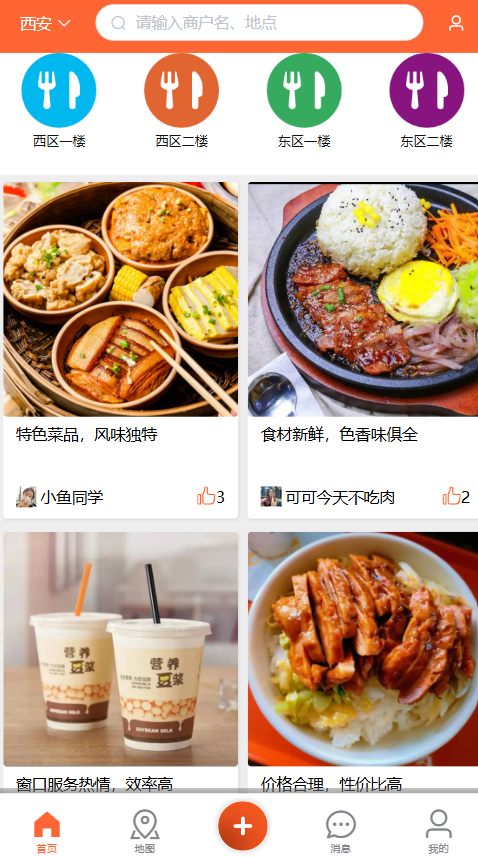
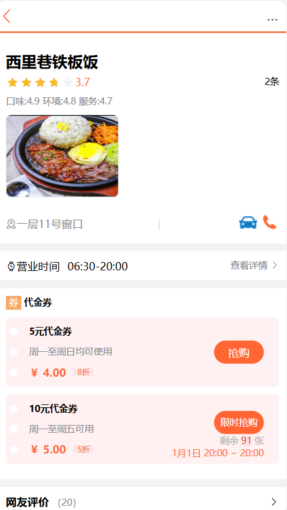
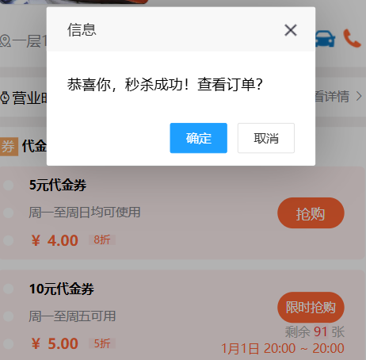
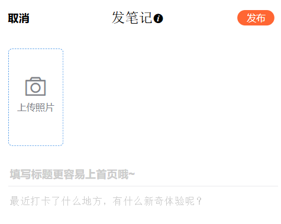
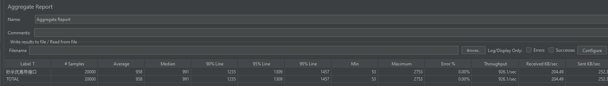

  
  
  
  
  
  
  
  
  
  
  
  

:fire:项目在线演示地址：`（电脑端使用F12修改为手机模式查看）`[http://8.130.82.154:80](http://8.130.82.154/)

## 校园餐厅点评网站介绍

本项目为点评网站实现的后端代码。该网站为用户提供校园餐厅中各个窗口的信息、支持用户点评和抢购优惠券等服务。实现了用户注册登录、餐厅窗口信息展示、优惠券秒杀等基础功能，优化了用户体验和系统性能。

## 项目功能

### 1. 登录模块

**核心功能**：接入阿里云短信服务，基于验证码进行用户的校验登录。

**扩展功能**：基于 redis 的 zest 数据结构和时间窗口思想，`限制验证码的发送频率`。在 redis 中保存 token 和用户信息，`实现分布式 Session`。将`用户信息存入 ThreadLocal`，封装线程隔离的对象。

### 2. 窗口信息管理模块

**核心功能**：提供校园餐厅中各个窗口的信息数据。

**扩展功能**：将窗口信息加载到 `redis 缓存`，提高响应速度。在更新数据库时，使用消息队列保证缓存删除成功，`保证缓存的最终一致性`。基于布隆过滤器`解决缓存穿透问题`。基于 redisson 互斥锁与逻辑过期`解决缓存击穿问题`。

### 3. 优惠券秒杀模块

**核心功能**：提供优惠券购买功能，保证一人一单以及防止库存超卖。

**扩展功能**：应对高并发场景下的一系列性能优化。`基于 redis 的库存预减`以及一人一单判断，在库存为空时添加`内存标记`，避免再访问 redis，使用令牌桶算法进行`限流`，使用 RabbitMQ 分化业务流程，实现`异步下单`。在测试代码中生成用于压测的大量用户数据，使用JMeter 进行`压测`。

### 4. 订单模块

**核心功能**：为具有购买资格的用户做订单处理。

**扩展功能**：引入了美团 Leaf 实现订单`全局唯一id生成`，基于 Websocket 实现`订单结果实时推送`，基于RabbitMQ 延迟消息实现`订单超时未支付检查`。

## 网站演示

**1、用户登录**

**2、网站首页**

**3、窗口详情页与秒杀优惠券**

**4、优惠券订单创建成功页面**

**5、发布评论页面**

**6、压测效果图**

